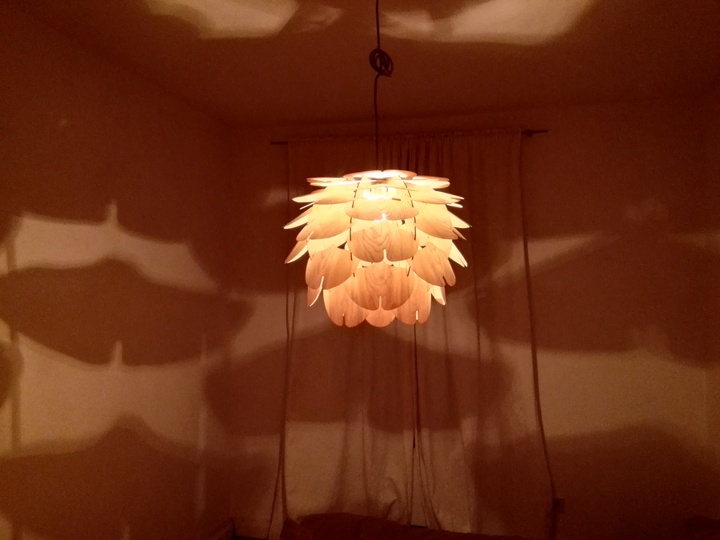
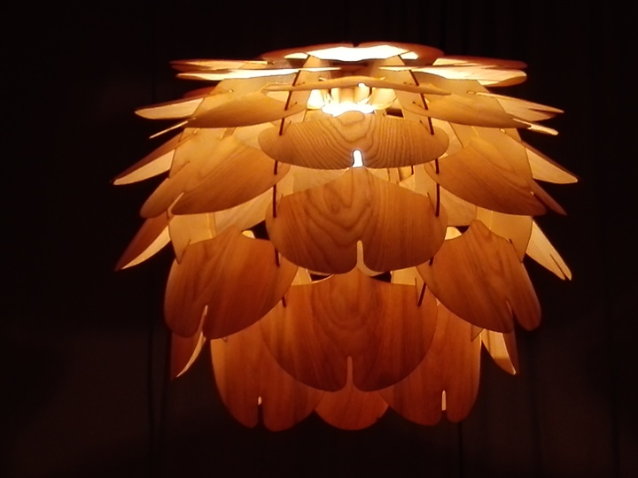
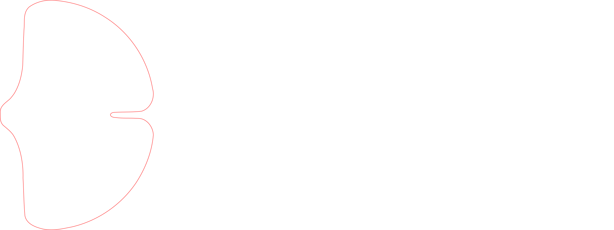

# woodlight

Holzleuchte aus Birkensperrholz und Eschenfurnier. Die Idee stammt nicht von mir. Gefunden habe ich das Modell bei [VITA copenhagen](https://www.vitacopenhagen.com/# "VITA copenhagen").

Die Rippen und Ringe wurden aus 3,6 mm starkem Birkensperrholz gelasert. 

Die Blätter aus ca. 0,7 mm starkem Eschenfurnier.

Man benötigt 8 Rippen, 2 verschiedene Ringe, 40 große Blätter und 4 oder wahlweise 8 kleine Blätter.

Umgesetzt wurde die Leuchte im [erfindergarden](http://www.erfindergarden.de) in München.